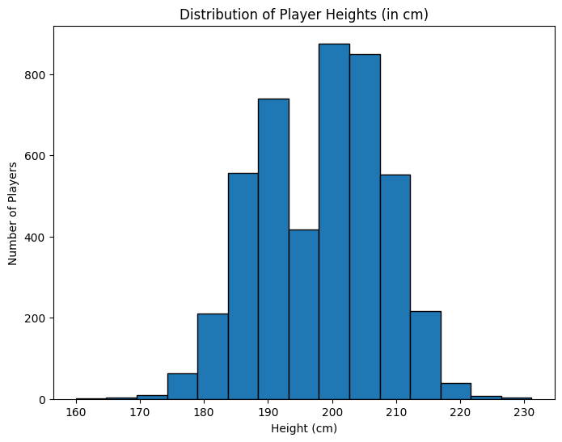

                                   INTRODUCTION TO DATA SCIENCE
                                                            -Lecturer:EMANUELPLAN

                                    REPORT-GROUP 9 :TOPIC BASKETBALL 

    
  

 INTRODUCTION 
 
  -The dataset "NBA Players Stats since 1950" is sourced from Kaggle, a well-known platform for data science competitions and datasets. It contains detailed statistical data for NBA
    players, starting from the 1950s to recent seasons. The dataset includes various player performance metrics like points per game, assists, rebounds, shooting 
    percentages, and more. Its purpose is to provide analysts and researchers with a comprehensive view of player performances across different eras of NBA history, enabling 
    comparisons and trend analysis over time

                                  import pandas as pd
                                  import numpy as np
                                  import matplotlib.pyplot as plt
                                  import pandas
                                  import statsmodels.api as sm
                                  import seaborn as sns
                                  # drive.mount('/content/drive')
                                  players = pd.read_csv('../input/nba-players-stats/player_data.csv')
                                  
    PLAYER SET CREATION
                                                  
                  
                  players['career_length'] = players['year_end'] - players['year_start']
                  players.head(10)
                

    
        name: The name of the player.
        
        year_start: The starting year of the player's career or the year they began playing in the dataset.
        
        year_end: The ending year of the player's career or the year they stopped playing in the dataset.
        
        position: The positions that players typically occupy, with percentages indicating the proportion of players in each position
       
        height: The height of players, categorized into ranges (e.g., 6-7, 6-8) with the percentage indicating how many players fall into 
             each range.
       
        weight: The weight of players, possibly indicating distribution across different weight ranges.
        
        birth_date: The birth dates of players, with a histogram showing how many players were born in specific years.
        
        college: Indicates the colleges that players attended, with a percentage showing the proportion of players from a specific college 
           
HEIGHT ISSUES

   In the dataset, the height information is provided in the format 'feet-inches', where a height of 70 inches would be represented as '6- 
   10', meaning 6 feet 10 inches. Since this format can complicate calculations, I have written the following code to convert these values 
   into the equivalent number of inches.

  Code: 
                                print(players['height'].head(4))

                                for i in range(len(players['height'])):
                                  if isinstance(players['height'][i], str):
                                     c = players['height'][i].split('-')
                                     players['height'][i] = 12 * float(c[0]) + float(c[1])
                                 players['height'].head(4)

BASIC ANALYSIS

 Code:
                                height_p = players.groupby(by = 'year_start')['height'].mean()

                                The goal is to observe changes in the players over the years from 1947 to 2018

                     

                  import pandas as pd
                  
                  import matplotlib.pyplot as plt
                  
                  import numpy as np
                  
                  import seaborn as sns
                  
                  # Load the data
                  
                  file_path = '/content/player_data.csv'
                  
                  df_nba = pd.read_csv(file_path)
                  
                  
                  # Function to convert height from feet-inches format (e.g., 6-10) to inches
                  
                  def height_to_inches(height):
                  
                      if isinstance(height, str) and '-' in height:
                      
                          feet, inches = height.split('-')
                          
                          return int(feet) * 12 + int(inches)
                          
                      return None
                  
                  # Apply the height conversion to the dataset
                  
                  df_nba['height_inches'] = df_nba['height'].apply(height_to_inches)
                  
                  # Convert height from inches to centimeters
                  
                  df_nba['height_cm'] = df_nba['height_inches'] * 2.54
                  
                  # Plot a histogram of player heights in centimeters
                  
                  plt.figure(figsize=(8,6))
                  
                  filtered_data = df_nba['height_cm'].dropna()
                  
                  plt.hist(filtered_data, bins=15, edgecolor='black')
                  
                  plt.title('Distribution of Player Heights (in cm)')
                  
                  plt.xlabel('Height (cm)')
                  
                  plt.ylabel('Number of Players')
                  
                  plt.show()

   

                                

                  
                                                         
