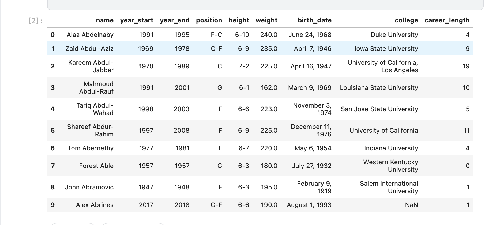
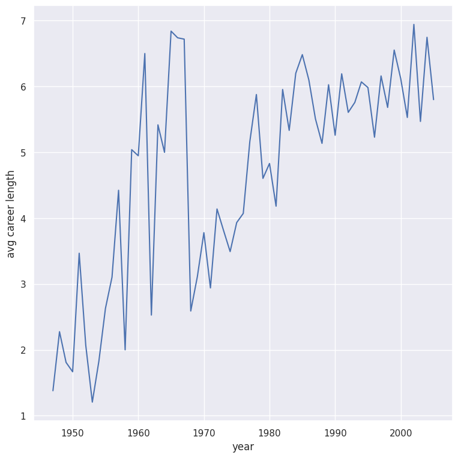

                                   INTRODUCTION TO DATA SCIENCE
                                                            -Lecturer:EMANUELPLAN

                                    REPORT-GROUP 9 :TOPIC BASKETBALL 

    
  

 INTRODUCTION 
 
  -The dataset "NBA Players Stats since 1950" is sourced from Kaggle, a well-known platform for data science competitions and datasets. It contains detailed statistical data for NBA
    players, starting from the 1950s to recent seasons. The dataset includes various player performance metrics like points per game, assists, rebounds, shooting 
    percentages, and more. Its purpose is to provide analysts and researchers with a comprehensive view of player performances across different eras of NBA history, enabling 
    comparisons and trend analysis over time

                                  import pandas as pd
                                  import pandas as pd
                                  import numpy as np
                                  import matplotlib.pyplot as plt
                                  import pandas
                                  import statsmodels.api as sm
                                  import seaborn as sns
                                  # drive.mount('/content/drive')
                                  players = pd.read_csv('../input/nba-players-stats/player_data.csv')
                                  
PLAYER SET CREATION
 
 Code :                                                               
                          
                            players['career_length'] = players['year_end'] - players['year_start']
                            players.head(10)

        

            players.columns
            years_s = players['year_start']
            years_e = players['year_end']
            height = players['height']
            weight = players['weight']
            college = players['college']
                    
                

    
  -name: The name of the player.

  -year_start: The starting year of the player's career or the year they began playing in the dataset.
  
  -year_end: The ending year of the player's career or the year they stopped playing in the dataset.
  
  -position: The positions that players typically occupy, with percentages indicating the proportion of players in each position:
  
  -height: The height of players, categorized into ranges (e.g., 6-7, 6-8) with the percentage indicating how many players fall into each 
   range.

  -weight: The weight of players, possibly indicating distribution across different weight ranges.
  
  -birth_date: The birth dates of players, with a histogram showing how many players were born in specific years.
  
  -college: Indicates the colleges that players attended, with a percentage showing the proportion of players from a specific college (e.g., 
    University of Kentucky: 7%).

           
HEIGHT ISSUES

   In the dataset, the height information is provided in the format 'feet-inches', where a height of 70 inches would be represented as '6- 
   10', meaning 6 feet 10 inches. Since this format can complicate calculations, I have written the following code to convert these values 
   into the equivalent number of inches.

  Code: 
                
                                print(players['height'].head(4))

                                for i in range(len(players['height'])):
                                  if isinstance(players['height'][i], str):
                                     c = players['height'][i].split('-')
                                     players['height'][i] = 12 * float(c[0]) + float(c[1])
                                 players['height'].head(4)

BASIC ANALYSIS

 Code:
                                height_p = players.groupby(by = 'year_start')['height'].mean()

  The goal is to observe changes in the players over the years from 1947 to 2018

                     

                  import pandas as pd
                  import matplotlib.pyplot as plt
                  import numpy as np
                  import seaborn as sns
                  
                  # Load the data
                  file_path = '/content/player_data.csv'
                  df_nba = pd.read_csv(file_path)
                  
                  # Function to convert height from feet-inches format (e.g., 6-10) to inches
                  
                  def height_to_inches(height):
                  
                      if isinstance(height, str) and '-' in height:
                      
                          feet, inches = height.split('-')
                          
                          return int(feet) * 12 + int(inches)
                          
                      return None
                  
                  # Apply the height conversion to the dataset
                  
                  df_nba['height_inches'] = df_nba['height'].apply(height_to_inches)
                  
                  # Convert height from inches to centimeters
                  
                  df_nba['height_cm'] = df_nba['height_inches'] * 2.54
                  
                  # Plot a histogram of player heights in centimeters
                  
                  plt.figure(figsize=(8,6))
                  
                  filtered_data = df_nba['height_cm'].dropna()
                  
                  plt.hist(filtered_data, bins=15, edgecolor='black')
                  
                  plt.title('Distribution of Player Heights (in cm)')
                  
                  plt.xlabel('Height (cm)')
                  
                  plt.ylabel('Number of Players')
                  
                  plt.show()

   

 
 COMPARATIVE ANAYLYSIS

Code:

          import pandas as pd
          import matplotlib.pyplot as plt
          import numpy as np
          import seaborn as sns
          
          # Load the data
          file_path = '/content/player_data.csv'
          df_nba = pd.read_csv(file_path)
          
          # Function to convert height from feet-inches format (e.g., 6-10) to inches
          def height_to_inches(height):
              if isinstance(height, str) and '-' in height:
                  feet, inches = height.split('-')
                  return int(feet) * 12 + int(inches)
              return None
          
          # Apply the height conversion to the dataset
          df_nba['height_inches'] = df_nba['height'].apply(height_to_inches)
          
          # Convert height from inches to centimeters
          df_nba['height_cm'] = df_nba['height_inches'] * 2.54
          
          # Filter player positions
          guards = df_nba[df_nba['position'] == 'G']
          forwards = df_nba[df_nba['position'] == 'F']
          centers = df_nba[df_nba['position'] == 'C']
          
          # Group by year and calculate mean height for each position group
          height_G = guards.groupby('year_start')['height_cm'].mean()
          height_F = forwards.groupby('year_start')['height_cm'].mean()
          height_C = centers.groupby('year_start')['height_cm'].mean()
          
          # Define major ticks for x and y axes
          major_ticks_y = np.arange(180, 240, 10)  # Adjusted for heights in centimeters
          major_ticks_x = np.arange(1945, 2020, 10)
          
          # Plotting
          sns.set()
          fig, ax = plt.subplots(figsize=(15, 10))
          
          # Plot heights for Guards, Forwards, and Centers
          height_G.plot(ax=ax, color='blue', label='Guards', marker='o')
          height_F.plot(ax=ax, color='green', label='Forwards', marker='o')
          height_C.plot(ax=ax, color='red', label='Centers', marker='o')
          
          # Set ticks and grid
          ax.set_xticks(major_ticks_x)
          ax.set_yticks(major_ticks_y)
          ax.grid(which='major')
          
          # Set axis labels and legend
          ax.set_xlabel('Year')
          ax.set_ylabel('Height of Players (cm)')
          ax.legend()
          plt.title('Average Height by Position Over Time')
          
          # Display the plot
          plt.show()

    

 LONGEVITY 
   
   Lastly let's attempt to get a sense of whether players who come into the NBA today are staying longer, or exiting quicker than those of  
   
  the 70s to 90s era. To do this however, we must omit players who are still playing, as they do not have a year_end date

 Code:

    import pandas as pd
    import numpy as np
    import matplotlib.pyplot as plt
    import seaborn as sns
    
    # Load the dataset
    players = pd.read_csv('/content/player_data.csv')
    
    # Calculate career length
    players['career_length'] = players['year_end'] - players['year_start']
    plt.title('The average career length of NBA players')
    older = players[np.logical_and(players['year_start'] >= 1970, players['year_start'] <= 1990)]
    older['career_length'] = older['year_end'] - older['year_start']
    older.head()
    print('The average career length of players who entered the NBA between 1970 and 1990 is', np.round(older['career_length'].mean(),2), 
     'years')
    print('The median career length of players who entered the NBA between 1970 and 1990 is', np.round(older['career_length'].median(),2), 
     'years')
    modern = players[np.logical_and.reduce((players['year_start'] >= 1995, players['year_end'] <= 2018,players['year_start'] <= 2005))]
    modern['career_length'] = modern['year_end'] - modern['year_start']
    modern.head()
    print('The average career length of players who entered the NBA between 1995 and 2005 is', 
    np.round(modern['career_length'].mean(),2),'years')
    print('The median career length of players who entered the NBA between 1995 and 2005 is', 
    np.round(modern['career_length'].median(),2),'years')
    retired = players[players['year_start'] <= 2005]
    sns.set()
    year_diff_mean = retired.groupby(by = 'year_start')['career_length'].mean()
    year_diff_mean.plot(x = year_diff_mean.index, grid = 'on', xlabel = 'year', ylabel = 'avg career length', figsize = (8,6))

  

**FINAL THOUGHTS**

This dataset serves as a rich resource for sports analysts, researchers, and basketball enthusiasts. Its breadth and depth allow for deep

dives into player performances and the changing dynamics of the NBA. By analyzing this data, one can uncover trends in playing styles, 

individual achievements, and how the league has evolved over time. Whether for academic purposes or fan engagement, the dataset offers a 

robust foundation for NBA-related insights.

SOURCES
 
     https://www.kaggle.com/drgilermo/nba-players-stats?select=player_data.csv
   
                  
                                                         
